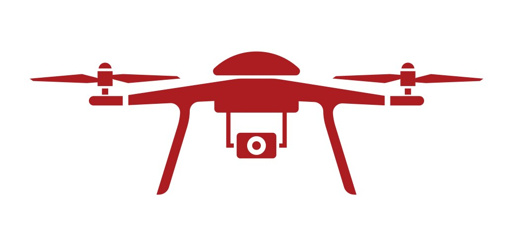

# GARUDA - Advanced Drone-Based Surveillance System

[](LICENSE)
[](https://www.python.org/)
[](https://flask.palletsprojects.com/)
[](https://github.com/ultralytics/ultralytics)
[](https://opencv.org/)
[](https://core.telegram.org/bots/api)

<p align="center">
  
</p>

## 📋 Table of Contents

- [Overview](#-overview)
- [Key Features](#-key-features)
- [System Architecture](#-system-architecture)
- [Installation Guide](#-installation-guide)
- [Configuration Options](#-configuration-options)
- [Usage Instructions](#-usage-instructions)
- [Technical Implementation](#-technical-implementation)
- [Performance Optimization](#-performance-optimization)
- [API Documentation](#-api-documentation)
- [Project Structure](#-project-structure)
- [Future Enhancements](#-future-enhancements)
- [Troubleshooting](#-troubleshooting)
- [Contributing](#-contributing)
- [License](#-license)
- [Acknowledgments](#-acknowledgments)
- [Contact Information](#-contact-information)

## 🔍 Overview

GARUDA is a state-of-the-art drone-based surveillance system designed for high-precision security monitoring and intrusion detection. Leveraging advanced computer vision algorithms and deep learning models, GARUDA can identify human presence in real-time video feeds, providing immediate alerts through integration with messaging platforms.

The system is built with flexibility in mind, supporting both live camera feeds (including drone-mounted cameras) and pre-recorded video analysis. With its intuitive web interface, GARUDA offers security professionals and enthusiasts a powerful tool for enhancing surveillance capabilities with minimal setup complexity.

## ✨ Key Features

- **Advanced Person Detection**: Utilizes YOLOv8 neural network architecture to accurately detect human presence with high confidence scores
- **Multi-source Video Processing**: Seamlessly handles inputs from webcams, IP cameras, drone feeds, and pre-recorded video files
- **Real-time Telegram Notifications**: Instantly delivers detection alerts with annotated images to designated recipients
- **Scheduled Surveillance**: Configurable time-based monitoring to optimize resource usage during critical hours
- **Performance Controls**: Fine-tune playback speed and frame rate to balance between detection accuracy and system resource utilization
- **Responsive Web Interface**: Modern, intuitive dashboard for monitoring and control across devices
- **Temporal Metadata**: Embeds timestamp information directly on video feeds for forensic documentation
- **Buffered Video Processing**: Implements advanced frame buffering for smooth video analysis even on variable-quality inputs
- **Asynchronous Alert System**: Non-blocking notification architecture ensures continuous monitoring during alert transmission

## 🏗 System Architecture

GARUDA employs a modular architecture consisting of the following components:

1. **Frontend Layer**: 
   - Responsive HTML/CSS/JavaScript interface
   - Real-time video display with detection overlays
   - Intuitive control panel for system configuration

2. **Application Layer**:
   - Flask web server handling HTTP requests and WebSocket connections
   - Route handlers for system control and status monitoring
   - Session management for surveillance parameters

3. **Processing Layer**:
   - Custom VideoCapture class with advanced buffering
   - YOLOv8 neural network for object detection
   - Frame processing pipeline with annotation capabilities

4. **Integration Layer**:
   - Telegram Bot API integration for notifications
   - File system handlers for video uploads and storage
   - Time synchronization with PyTZ for scheduled operations

## 📥 Installation Guide

### System Requirements

- **Operating System**: Windows 10/11, macOS 10.15+, or Ubuntu 20.04+
- **CPU**: Quad-core processor, 2.5 GHz or higher
- **RAM**: Minimum 8GB (16GB recommended for optimal performance)
- **GPU**: NVIDIA GPU with CUDA support recommended for faster detection
- **Storage**: At least 1GB of free disk space
- **Camera**: USB webcam, IP camera, or drone camera feed (optional)

### Prerequisites

- Python 3.8 or higher
- pip package manager
- Git (for cloning the repository)

### Step-by-Step Installation

1. **Clone the repository**:

```bash
git clone https://github.com/Surya-KF/Garuda---Drone-Based-Surveillance-System.git
```

2. **Navigate to the project directory**:

```bash
cd Garuda---Drone-Based-Surveillance-System
```

3. **Create and activate a virtual environment** (recommended):

```bash
python -m venv venv
```

On Windows:
```bash
venv\Scripts\activate
```

On macOS/Linux:
```bash
source venv/bin/activate
```

4. **Install required dependencies**:

```bash
pip install flask opencv-python ultralytics pytz requests
```

Alternatively, if a requirements.txt file is available:

```bash
pip install -r requirements.txt
```

5. **Download the YOLOv8 model** (automatic on first run, but can be done manually):

```bash
python -c "from ultralytics import YOLO; YOLO('yolov8n.pt')"
```

6. **Create required directories**:

```bash
mkdir -p uploads static/img
```

7. **Run the application**:

```bash
python app.py
```

8. **Access the web interface** by navigating to:
```
http://127.0.0.1:5000/
```

## ⚙️ Configuration Options

### Surveillance Settings

| Parameter | Description | Default Value |
|-----------|-------------|---------------|
| Input Type | Select between camera feed or video file | Camera |
| Video Source | Camera index or path to video file | 0 (primary webcam) |
| Telegram Bot Token | API token for Telegram notifications | Empty (notifications disabled) |
| Telegram Chat ID | Recipient ID for Telegram notifications | Empty (notifications disabled) |
| Start Time | Beginning of surveillance time window | 00:00:00 (midnight) |
| End Time | End of surveillance time window | 23:59:59 (end of day) |
| Playback Speed | Speed multiplier for video playback | 1.0 (normal speed) |
| Target FPS | Desired frames per second for processing | 15 FPS |

### Advanced Configuration

For advanced users, the following parameters can be modified in the `app.py` file:

- **Detection Confidence Threshold**: Minimum confidence score for person detection (default: 0.4)
- **Detection Interval**: Number of frames between detection operations (default: every 3rd frame)
- **Notification Cooldown**: Minimum time between Telegram notifications (default: 10 seconds)
- **Frame Resize Dimensions**: Resolution for processing frames (default: 640px width, maintaining aspect ratio)

## 🚀 Usage Instructions

### Setting Up Surveillance

1. **Configure Input Source**:
   - Select "Camera" to use a connected webcam or camera
   - Select "Video File" to upload and analyze a pre-recorded video

2. **Set Up Notifications** (Optional):
   - Create a Telegram bot using [BotFather](https://t.me/botfather) and obtain the API token
   - Determine your Telegram Chat ID (use [userinfobot](https://t.me/userinfobot))
   - Enter both values in the respective fields

3. **Configure Monitoring Schedule**:
   - Set the "Start Time" and "End Time" to define when surveillance should be active
   - The system will only process video and send alerts during this time window

4. **Adjust Performance Settings** (Optional):
   - Modify "Playback Speed" for video files (higher values process video faster)
   - Set "Target FPS" to balance between processing load and detection accuracy

5. **Start Surveillance**:
   - Click the "Start Surveillance" button to begin monitoring
   - The video feed will display in real-time with detection overlays

### Monitoring and Control

- **Status Indicator**: Shows whether the system is currently online or offline
- **Current Time Display**: Shows the current time for reference against the scheduled window
- **Video Feed**: Displays the processed video with person detection bounding boxes
- **Stop Button**: Immediately halts surveillance and returns the system to standby mode

### Receiving Alerts

When a person is detected in the video feed:

1. The individual will be highlighted with a green bounding box in the video feed
2. If Telegram notifications are configured, you will receive:
   - An image capture of the detected person
   - A caption indicating "Person detected!"
   - Timestamp information embedded in the image

## 🔧 Technical Implementation

### Video Processing Pipeline

1. **Frame Acquisition**:
   - Custom `VideoCapture` class manages frame retrieval from the source
   - Implements frame buffering to handle variable frame rates
   - Controls playback speed for video file analysis

2. **Pre-processing**:
   - Frames are resized to optimize processing performance
   - Frame skipping is applied based on target FPS settings

3. **Object Detection**:
   - YOLOv8 neural network processes frames to identify people
   - Detection runs on a subset of frames to balance performance
   - Confidence filtering removes low-probability detections

4. **Post-processing**:
   - Detected persons are annotated with bounding boxes and labels
   - Timestamp information is overlaid on each frame
   - Processed frames are encoded to JPEG format for streaming

5. **Alert Generation**:
   - Person detections trigger the notification system
   - Rate limiting prevents alert flooding
   - Asynchronous processing ensures continuous monitoring

### YOLOv8 Integration

GARUDA leverages the state-of-the-art YOLOv8 object detection model, which offers:

- Fast inference times suitable for real-time applications
- High accuracy in detecting persons in various poses and lighting conditions
- Robust performance across different video qualities
- Low false positive rates compared to earlier detection models

The system uses the "nano" variant (yolov8n.pt) by default, balancing speed and accuracy, but can be configured to use larger models for higher precision.

## ⚡ Performance Optimization

GARUDA implements several optimization strategies to ensure smooth operation across different hardware configurations:

1. **Adaptive Frame Processing**:
   - Intelligent frame skipping based on system capabilities
   - Processing resolution adjustment to maintain performance
   - Detection frequency tuning to balance CPU/GPU usage

2. **Efficient Resource Utilization**:
   - Threaded video capture to prevent I/O blocking
   - Asynchronous notification delivery to maintain processing throughput
   - Event-based frame handling to reduce unnecessary computations

3. **Memory Management**:
   - Frame buffer control to prevent memory leaks
   - Explicit garbage collection during long-running sessions
   - Resource cleanup on surveillance termination

4. **Processing Throttling**:
   - Target FPS limiting to prevent system overload
   - Time-based sleep intervals to regulate processing rate
   - Cooldown periods for resource-intensive operations

## 📚 API Documentation

### RESTful Endpoints

| Endpoint | Method | Description | Parameters | Response |
|----------|--------|-------------|------------|----------|
| `/` | GET | Serves the main web interface | None | HTML page |
| `/video_feed` | GET | Provides MJPEG stream of processed video | None | MJPEG stream |
| `/start_surveillance` | POST | Initiates surveillance with provided settings | Form data with configuration parameters | JSON status |
| `/stop_surveillance` | POST | Terminates the current surveillance session | None | JSON status |
| `/status` | GET | Retrieves current system status | None | JSON with system state |

### Request/Response Examples

#### Starting Surveillance

**Request:**
```
POST /start_surveillance
Content-Type: multipart/form-data

input_type: Camera
token: 1234567890:ABCDEFGHIJKLMNOPQRSTUVWXYZ
chat_id: 123456789
from_time: 08:00:00
to_time: 20:00:00
playback_speed: 1.0
target_fps: 15
```

**Response:**
```json
{
  "status": "success",
  "message": "Surveillance started"
}
```

#### Checking Status

**Request:**
```
GET /status
```

**Response:**
```json
{
  "is_running": true,
  "input_type": "Camera",
  "from_time": "08:00:00",
  "to_time": "20:00:00",
  "playback_speed": 1.0,
  "target_fps": 15
}
```

## 📁 Project Structure

```
garuda-surveillance/
├── app.py                 # Main application file with Flask server and processing logic
├── static/                # Static assets directory
│   ├── css/               # CSS stylesheets
│   │   └── style.css      # Main stylesheet for the web interface
│   ├── img/               # Image assets
│   │   ├── logo.jpg       # GARUDA logo
│   │   └── placeholder.jpg # Default image when surveillance is inactive
│   └── js/                # JavaScript files
│       └── main.js        # Client-side functionality for the web interface
├── templates/             # HTML templates
│   └── index.html         # Main interface template with control panel
├── uploads/               # Directory for storing uploaded video files
├── .gitignore             # Git ignore file
├── requirements.txt       # Python dependencies
├── LICENSE                # License information
└── README.md              # Project documentation
```

## 🔮 Future Enhancements

The GARUDA development roadmap includes the following planned enhancements:

1. **Multi-class Detection**:
   - Expand beyond person detection to identify vehicles, animals, and other objects
   - Custom training for specific threat detection

2. **Advanced Analytics**:
   - Motion trajectory tracking and analysis
   - Behavior pattern recognition
   - Crowd density estimation

3. **Enhanced Notification System**:
   - Support for additional messaging platforms (WhatsApp, SMS, Email)
   - Customizable alert messages and severity levels
   - Alert aggregation and summary reports

4. **User Management**:
   - Multi-user access with role-based permissions
   - Authentication and secure access controls
   - User activity logging

5. **Edge Computing Support**:
   - Optimization for deployment on edge devices (Raspberry Pi, Jetson Nano)
   - Reduced bandwidth operation modes
   - Local processing with cloud synchronization

## ❓ Troubleshooting

### Common Issues and Solutions

| Issue | Possible Cause | Solution |
|-------|---------------|----------|
| Camera not detected | Driver issues or incorrect camera index | Try different camera indices (0, 1, 2) or reinstall camera drivers |
| Slow detection performance | Insufficient system resources | Lower the target FPS, reduce processing resolution, or use a more powerful machine |
| Telegram notifications not working | Incorrect token or chat ID | Verify credentials and ensure the bot has been started by the recipient |
| High CPU usage | Processing too many frames | Increase frame skipping, lower target FPS, or reduce video resolution |
| Video file not playing | Unsupported codec or format | Convert video to MP4 with H.264 encoding |
| "No module found" error | Missing dependencies | Ensure all required packages are installed via pip |

### Logging and Debugging

For advanced troubleshooting, enable debug mode in Flask:

```python
if __name__ == '__main__':
    app.run(debug=True, threaded=True)
```

This will provide detailed error messages and stack traces in the console output.

## 👥 Contributing

We welcome contributions to enhance GARUDA's capabilities! Here's how you can contribute:

1. **Fork the Repository**:
   - Create your own fork of the project

2. **Create a Feature Branch**:
   ````bash
   git checkout -b feature/amazing-feature</CODE_TO_UPDATE>

3. **Implement Your Changes**:
   - Add your feature or fix bugs
   - Follow the existing code style and patterns
   - Add appropriate comments and documentation

4. **Test Your Changes**:
   - Ensure your code works as expected
   - Verify that existing functionality remains intact
   - Test on different platforms if possible

5. **Commit Your Changes**:
   ```bash
   git commit -m 'Add some amazing feature'
   ```

6. **Push to Your Branch**:
   ```bash
   git push origin feature/amazing-feature
   ```

7. **Submit a Pull Request**:
   - Create a pull request from your branch to the main repository
   - Provide a clear description of the changes and their purpose
   - Reference any related issues

8. **Code Review**:
   - Address any feedback or requested changes
   - Collaborate with maintainers to refine your contribution

### Contribution Guidelines

- Follow PEP 8 style guidelines for Python code
- Write clear, descriptive commit messages
- Include documentation for new features
- Add tests for new functionality when possible
- Keep pull requests focused on a single feature or fix

## 📜 License

This project is licensed under the MIT License - see the [LICENSE](LICENSE) file for details.

### MIT License Summary

- Permission to use, copy, modify, and distribute the software
- The software is provided "as is", without warranty of any kind
- The authors or copyright holders cannot be held liable for any claims or damages

## 🙏 Acknowledgments

GARUDA stands on the shoulders of giants. We extend our gratitude to:

- **Ultralytics** for the exceptional YOLOv8 object detection framework
- **OpenCV** team for their comprehensive computer vision library
- **Flask** developers for the lightweight and flexible web framework
- **Telegram** for providing a robust API for notifications
- **Python Community** for creating and maintaining the libraries that power this project
- **Open Source Contributors** whose work has inspired and enabled this project

## 📞 Contact Information

### Project Maintainer

**Surya KF**
- GitHub: [Surya-KF](https://github.com/Surya-KF)
- Email: [suryakf@gmail.com](mailto:suryakf@gmail.com)

### Repository

- Project URL: [https://github.com/Surya-KF/Garuda---Drone-Based-Surveillance-System](https://github.com/Surya-KF/Garuda---Drone-Based-Surveillance-System)
- Issues: [https://github.com/Surya-KF/Garuda---Drone-Based-Surveillance-System/issues](https://github.com/Surya-KF/Garuda---Drone-Based-Surveillance-System/issues)

## 📊 Project Statistics


---

<p align="center">
  <b>GARUDA - Vigilance Elevated</b><br>
  <i>Transforming surveillance with intelligent vision technology</i>
</p>
